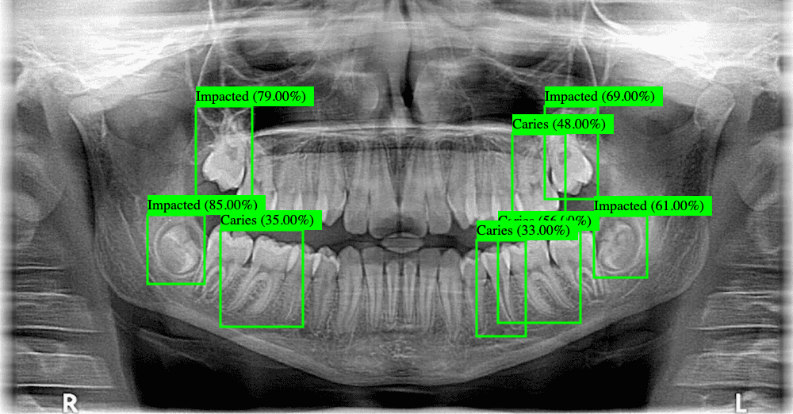

# SmileVision AI: Transforming Dentistry with AI

Welcome to SmileVision AI – your gateway to revolutionizing dental diagnostics through cutting-edge computer vision technology. Dive into our world of AI-powered teeth X-ray analysis and witness the future of dental care unfold before your eyes. Whether you're a dental professional seeking advanced diagnostic tools or simply curious about the intersection of AI and healthcare, SmileVision AI has something for you.

## Explore the Possibilities

### 1. Self-Hosting Made Easy
Want to take control of your dental AI experience? With SmileVision AI, self-hosting is a breeze. Simply follow our straightforward instructions to deploy the web interface on your own system. Whether you opt for our pre-trained YOLOv8 model or decide to embark on your training journey, we've got you covered.

### 2. Seamless Training Process
Curious about the magic behind the scenes? Dive into the training process and discover how we harness the power of the YOLO package from the Python Ultralytics library to train our models. With access to the Dentex dataset via Roboflow, you'll be equipped to train models tailored to your specific needs.

### 3. Performance Evaluation
Numbers don't lie – explore our model's performance metrics and see the impact of our AI technology firsthand. From caries detection to identifying impacted teeth, SmileVision AI delivers impressive results that redefine dental diagnostics. Evaluate our hyperparameters and ponder the possibilities of achieving even greater accuracy through personalized training.

## Join the SmileVision AI Community

Are you ready to embark on a journey at the forefront of dental innovation? Whether you're a developer, researcher, or dental professional, there's a place for you in the SmileVision AI community. Collaborate with like-minded individuals, share insights, and shape the future of dental care together.

## Experience the Future Today

Don't just imagine the possibilities – experience them with SmileVision AI. Explore our demo deployment or take control with self-hosting. With SmileVision AI, the future of dental diagnostics is here, and it's brighter than ever.

Ready to transform dentistry with AI? Visit [SmileVision AI](https://xray.cyphersec.eu/) now!
